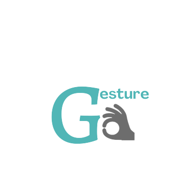

# GestureGo

<!--  -->

## Problem Statement

All day to day activities require effective interpersonal communication
for both personal and professional settings. But people with hearing, visual
and speech impairments, find it extremely difficult to interact with others.

When over 1.5 billion people suffer from hearing loss around the world, deaf sign language users make up only about 0.1% of the total population in any given country. This can have a vastly negative impact on their mental health. Studies reveal that deaf/mute people are around twice as likely to suffer from psychological problems.

## Solution

We propose an application, GestureGo, which will facilitate bidirectional communication between people with hearing or speech impairments and other people which in turn will lessen the communication gap between them and allowing everyone to understand and be understood.

## Tech stack

- **FrontEnd:** [Django](https://www.djangoproject.com/) and [Tailwind CSS](https://tailwindcss.com/)
- **API:** [Django Rest Framework](https://www.django-rest-framework.org/) for the API ([Python](https://www.python.org/))
- **Database:** [PostgreSQL]()
- **Other libraries:** [Tensorflow](https://www.tensorflow.org/), Pyaudio, PIL, Google Cloud Translator API
- **Cloud:** [Google Cloud](https://cloud.google.com/)
- **Version Control and Hosting:** [Git](https://git-scm.com/) for Source Code Management and [Netlify](https://netlify.com) for hosting

## Prerequisites for Setup

Create an OAuth2 Client

1. Go to the [Google Cloud Platform Console](https://console.cloud.google.com/)
2. From the projects list, select a project or create a new one
3. If the APIs & services page isn't already open, open the console left side menu and select APIs & services
4. On the left, click Credentials
5. Click New Credentials, then select OAuth client ID
6. Select `Web application` in the Application type
7. Give a name to the application
8. In Authorized Javascript origins add `http://localhost:8000`
9. In Authorized redirect URIs add `http://localhost:8000/login/redirect`
10. Click on Create button
11. Note Client ID and Client Secret

## Local Setup

- Fork and clone the repository.
- Add remote upstream `git remote add upstream https://github.com/varisha-025/GestureGo`
<!-- - [ui setup](https://github.com/BitByte-TPC/gymkhana/tree/master/ui#readme)
- [api setup](https://github.com/BitByte-TPC/gymkhana/tree/master/api#readme) -->

## Setup using Docker

- Fork and clone the repository.
- Add remote upstream `git remote add upstream https://github.com/varisha-025/GestureGo`
- Create a new file named: `.env` and
  copy all the content from the respective `.env.template` files.
- Run `docker compose up` to start

## Want to contribute?

Check out [CONTRIBUTING.md](CONTRIBUTING.md).